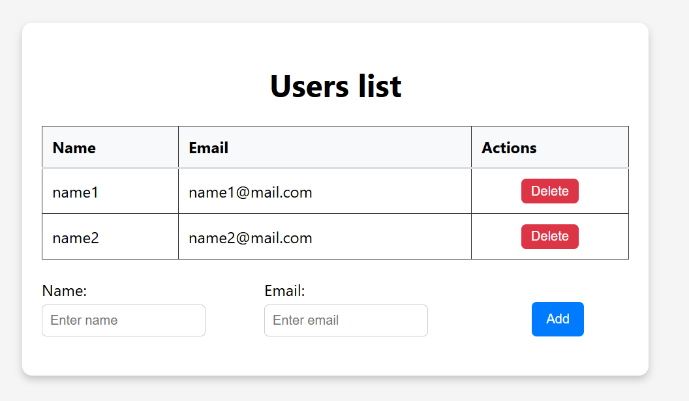

# HTTPS server with integrated SQLite database using stackless coroutines (C++20) 

### 1.Simplified cross-platform (Windows, Linux) http server for ssl support and with integrated SQLite database 
This project shows an example of using stackless coroutines (including nested coroutines) for client connections

### Usage variants:
> #### 1.1
```cpp
	HttpsServer srv("cert.pem", "key.pem");
	srv.Use("GET","/1", [&](const std::string& req, std::string& resp) {
        resp = "Page 1";
		cout << req;
		});
	srv.Use("GET", "/2", [&](const std::string& req, std::string& resp) {
		resp = "Page 2";
		cout << req;
		});
```
> #### 1.2 Web interface usage:
```cpp
	std::string path_web_inerface = "web_interface/build";
	HttpsServer srv("cert.pem", "key.pem", path_web_inerface);
	srv.Use("GET", "*", nullptr);
```
> #### 1.3 SQLite datfbase usage: (for the web interface variant presented in 'web_interface/build')
```cpp
       std::string base_name = "base_sql.db";
       vector <std::string> fields_base = { "name", "email" };
       HttpsServer srv("cert.pem", "key.pem", path_web_inerface, base_name, fields_base);
       srv.Use("GET",    "/api/items", nullptr);
       srv.Use("POST",   "/api/items", nullptr);
       srv.Use("DELETE", "/api/items/id", nullptr);
```
### 2. Second version of the server 10k. 
It is implemented in C++ using C++20 coroutines, Boost.Asio library (version 1.80+ to support C++20 coroutines) 
and PostgreSQL client - libpqxx. Boost.Asio and C++20 coroutines are also used for asynchronous queries to PostgreSQL.
This example demonstrates a server that can potentially (depending on hardware capabilities) handle 10k 
queries connecting to a PostgreSQL database.
(Boost.Asio header <coroutine> is plugged inside the library itself if the compiler supports C++20 coroutines)

```cpp
 #include "serv_boost/HttpsServerBoost.h"

int main() {

	std::string path_web_inerface = "web_interface/build";
	std::string base_config = std::string("dbname=test user=postgres password=pasw host=127.0.0.1 port=8121");
	
	HttpsServBoost serv_b("cert.pem", "key.pem", path_web_inerface, base_config);
	
	serv_b.Use("GET", "/api/items", nullptr);
	serv_b.Use("POST", "/api/items", nullptr);
	serv_b.Use("DELETE", "/api/items/id", nullptr);
	
	serv_b.Listen(8120);
	return 0;
}
```
> #### A variant of a dynamically modifiable web interface built with React: (web_interface/build)

<p align="center">
  
</p>
